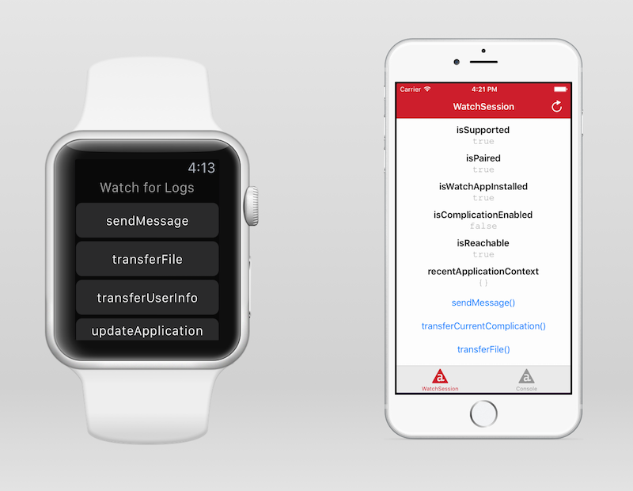
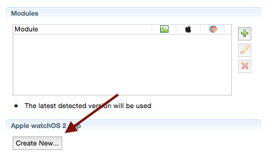
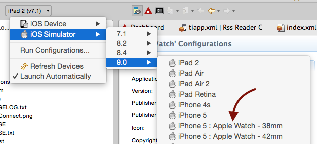
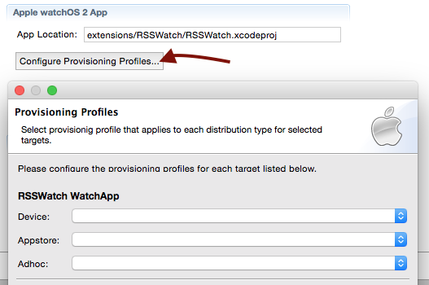

# WatchSession
*Communicating between a Titanium App and a Xcode watchOS 2 App.*

Titanium 5.0.0 adds support for bundling and communicating with an Xcode built watchOS 2 App. I will walk you through adding and launching a Watch App for your own Titanium apps and then use the example to explain how you can communicate between them.

## Architecture of watchOS2
But first, please make yourself familiar with the architecture of watchOS 2 and the difference with watchOS 1. Apple has an excellent [WatchKit Programming Guide](https://developer.apple.com/library/prerelease/watchos/documentation/General/Conceptual/WatchKitProgrammingGuide/index.html) and in particular the [Watch App Architecture](https://developer.apple.com/library/prerelease/watchos/documentation/General/Conceptual/WatchKitProgrammingGuide/DesigningaWatchKitApp.html#//apple_ref/doc/uid/TP40014969-CH3-SW1) section is very helpful as it shows Watch Apps still have a WatchKit Extension but it now runs on the Apple Watch instead of the iPhone. In your WatchKit Extension you will use Apple's [Watch Connectivity Framework](https://developer.apple.com/library/prerelease/ios/documentation/WatchConnectivity/Reference/WatchConnectivity_framework/index.html) directly, while in your Titanium app you talk to the same framework via [Ti.WatchSession](https://appcelerator.github.io/appc-docs/latest/#!/api/Titanium.WatchSession).

## Adding a Watch App to your own Titanium App

Use the CLI to create and add an Xcode project with Obj-C Watch App and Extension to an existing Titanium iOS App:

	cd ~/your-ti-app
	appc new --type applewatch --template watchos2 --name "Your Watch App"
	
The project name is what users will see in the Apple Companion app and Watch. It doesn't need to be the same as the `<name>` of you Titanium app's `tiapp.xml`. You will find the Xcode project under `~/your-ti-app/extensions/Your Watch App` which will also be added to `tiapp.xml` for you. The template includes the code of this sample so you can connect to it from your Titanium app using `Ti.WatchSession` right away.

In Studio you'll find a new *Apple watchOS2 App* section in the Tiapp Editor where you can click *Create New...* to walk through the above steps.

	
## Launching a Titanium App with its Watch App
Here's how you run you Titanium App and its Watch App.

### Simulator
To run both your Titanium App and its watchOS 2 app from the CLI:

	appc run --platform ios --ios-version 9.0 --launch-watch-app
	
While you still have Xcode 6 installed and selected, use `--ios-version` (`-I`) to select the iOS 9 SDK found in Xcode 7. The `--launch-watch-app` option will take care of launching the Watch App simulator, pairing it with the iOS Simulator and installing and launching your app.

In Studio, simply select a 9.0 iPhone + Watch Simulator pair:

	
### Device
Deploying to your iPhone and Apple Watch Device takes a little more effort.

#### Provisioning

First of all, you'll need an iPhone [running iOS 9](https://developer.apple.com/ios/download/) and a paired Apple Watch [running watchOS 2](https://developer.apple.com/watchos/download/).

Then open Xcode (*Window > Devices*) to lookup the UDID of your Apple Watch and make sure both your iPhone and Apple Watch are [registered](https://developer.apple.com/account/ios/device/deviceList.action?deviceClasses=watch) and added to the wildcard [provisioning profile](https://developer.apple.com/account/ios/profile/profileList.action?type=limited) you use for development. If it's managed by Xcode, I haven't found a way to have Xcode add the Watch so I just created a new provisioning profile for your wildcard App ID. Don't forget to download and open the updated provisioning profile or pull it in via Xcode (*Preferences > Accounts > View Details... > Download all*).

Ultimately, you are probably going to use an Explicit App ID (so you can use *Push Notifications* etc.) and then you'll have to create these (and the related provisioning profiles) for both the Titanium App, the Watch App and Extension. Yes, three of them.. I know. But for this sample and development, just use a wildcard.

No we only need to set the UUID of the provisioning profiles in [tiapp.xml](tiapp.xml). Run `appc ti info -t ios` to verify you have installed them correctly, copy their UUID's and then add it to the targets under `ios/extensions`:

    <extensions>
      <extension projectPath="extensions/WatchOS2/WatchOS2.xcodeproj">
        <target name="WatchOS2 WatchApp Extension">
          <provisioning-profiles>
            <device>YOUR-PP-UUID-HERE</device>
            <dist-appstore/>
            <dist-adhoc/>
          </provisioning-profiles>
        </target>
        <target name="WatchOS2 WatchApp">
          <provisioning-profiles>
            <device>YOUR-PP-UUID-HERE</device>
            <dist-appstore/>
            <dist-adhoc/>
          </provisioning-profiles>
        </target>
      </extension>
    </extensions>
    
In Studio the Tiapp Editor has a *Configure Provisioning Profiles...* button to do this:

	
#### Deploying

Then build to device like normal, just make sure that you use the iOS 9 SDK and the same provisioning profile:

	appc run -p ios -I 9.0 --target device --device-id ? --pp-uuid ?
	
You can either replace `?` with the exact values found via `appc ti info -t ios` or leave them there and unless you've set `appc ti config set cli.prompt false` the CLI will let you select from the found devices (`-C`) and profiles (`-P`).

In Studio the wizard to *Run on iOS Device* will let you select the *SDK version* and *Provisioning Profile*.
	
## Communicating between the Titanium and Watch App
Now that we know how to run the sample, let's see how it works.

### In the Watch App & Extension
There's only a few relevant files in the Xcode project and targets. Go ahead and open [extensions/WatchOS2/WatchOS2.xcodeproj](extensions/WatchOS2/WatchOS2.xcodeproj) in Xcode 7.

#### Storyboard
You can find the Watch App storyboard under [WatchOS2/WatchOS2 WatchApp/interface.storyboard](extensions/WatchOS2/WatchOS2 WatchApp/Base.lproj/interface.storyboard). As you can see we have scenes for the App, Glances and notifications. Only the App storyboard (*Interface Controller Scene*) has been populated with some buttons.

> See [Apple Watch Programming Guide / Watch Apps](https://developer.apple.com/library/prerelease/watchos/documentation/General/Conceptual/WatchKitProgrammingGuide/CreatingtheUserInterface.html#//apple_ref/doc/uid/TP40014969-CH4-SW1) for information about building UIs for Apple Watch.

#### Controller
The related controller can be found in the Extension under [WatchOS2/WatchOS2 WatchApp Extension/InterfaceController.m](extensions/WatchOS2/WatchOS2 WatchApp Extension/InterfaceController.m) and [InterfaceController.h](extensions/WatchOS2/WatchOS2 WatchApp Extension/InterfaceController.h).

#### Connecting to the Titanium App

In the header I've imported `WatchConnectivity`, add `WCSessionDelegate`. I also declare properties I will use to keep track of the session and last received log and image, outlets form the Storyboard I use and the public methods te Storyboard uses.

Then in `InterfaceController.m` I'll have to activate the Watch Session each time the Watch Extension activates. If you don't, it will not be able to communicate with the Titanium App. I activate the session in `willActivate`:

		- (void)willActivate {
		    
		    [super willActivate];
		    
		    if ([WCSession isSupported] && watchSession == nil) {
		        watchSession = [WCSession defaultSession];
		        watchSession.delegate = self;
		        [watchSession activateSession];
		    }
		}

As you can see in the [full sample code](extensions/WatchOS2/WatchOS2 WatchApp Extension/InterfaceController.m) I also restore the last received log (and image) here. If the Watch App was not active while it received something from the iPhone the delegate's calls to `showLog` will not have updated the UI so we do that here using the properties we also save the logs and images to when we receive them.

#### Sending to the Titanium App

Under the `#pragma mark watch methods` you'll find the 4 methods that the 4 buttons in the UI call. They demonstrate the 4 methods of  [WCSession](https://developer.apple.com/library/prerelease/ios/documentation/WatchConnectivity/Reference/WCSession_class/index.html#//apple_ref/occ/cl/WCSession) to send a message (simple object to send right away), file, userInfo (simple object, queued to be send in background) or update the applicationContext (simple object, of which only the last one will be delivered when the Titanium App resumes).

	-(IBAction)transferFile:(id)sender
	{
	    NSURL *fileURL = [[NSBundle mainBundle] URLForResource:@"logo" withExtension:@"png"];
	    [watchSession transferFile:fileURL metadata:[NSDictionary dictionaryWithObjectsAndKeys:@"bar",@"foo",nil]];
	}

#### Receiving from the Titanium App

Then under `#pragma mark watch delegates` we continue with the delegates that listen to events received from the Titanium App. As you can see there are also events to let us know if a file or userInfo was transferred successfully. All events are logged in the Watch App UI and received images are displayed as well.

	- (void)session:(nonnull WCSession *)session didReceiveFile:(nonnull WCSessionFile *)file
	{
	    NSURL *url = [file fileURL];
	    [self showLog:[NSString stringWithFormat:@"didReceiveFile %@", file.description] withImage:[NSData dataWithContentsOfURL:url] andMode:@"live"];
	}

### In the Titanium App

In the Titanium app we'll use `Ti.WatchSession` to access the exact same *WatchConnectivity framework*. The properties, method names and event names are also identical.

#### Connecting and Receiving

In [app/controllers/watchsession.js](app/controllers/watchsession.js) you can see that we have to call [activateSession()](https://appcelerator.github.io/appc-docs/latest/#!/api/Titanium.WatchSession-method-activateSession) just like we did for the Watch App. We then add event listeners to all events and show the current value of all the properties in the [view](app/views/watchsession.xml). You can tap the label of a property anytime to update just that value or use the refresh button to update all. Any data received from the Watch App is displayed in a notification and also logged to the console and the app's *Console* tab.

#### Sending to the Watch App

The event listeners for the different buttons in the view demonstrate each of the methods to send files and information to the Watch App. As you can see there are also `cancel*` methods. They can only be tested if your Watch is out of reach or for some other reason data cannot be transferred to the Watch and is queued.
	
	Ti.WatchSession.transferFile({
		fileURL: '/docs/logo.png',
		metaData: createSamplePayload()
	});

## Final notes

There's a lot more to do about Apple Watch apps. Checkout the *Links* section for more information after I close of with some final notes:

* You can change the Watch App's name later in Xcode via *WatchOS2 > Targets > WatchOS2 WatchApp > General > Identity > Display Name*.
* You have to manage the icons for the Watch App yourself via the Xcode project's [asset catalog](extensions/WatchOS2/WatchOS2 WatchApp/Assets.xcassets/AppIcon.appiconset). You can use the [TiCons CLI]() or [Website](http://ticons.fokkezb.nl/) to generate these.
* Via the Storyboard for the Watch App you can also control scenes to display custom information to notifications. If you are already using [interactive notifications](https://github.com/appcelerator-developer-relations/appc-sample-notifywatch) then be aware that actions with `..ACTIVATION_MODE_FOREGROUND` will now open the Apple Watch App instead of the iOS app. The [Apple Watch Notifications guide](https://developer.apple.com/library/prerelease/ios/documentation/General/Conceptual/WatchKitProgrammingGuide/BasicSupport.html#//apple_ref/doc/uid/TP40014969-CH18-SW1) explains how to handle both.
* In the same way, you can also include a [Glance](https://developer.apple.com/library/prerelease/ios/documentation/General/Conceptual/WatchKitProgrammingGuide/ImplementingaGlance.html#//apple_ref/doc/uid/TP40014969-CH5-SW1) and [Complication](https://developer.apple.com/library/prerelease/watchos/documentation/General/Conceptual/AppleWatch2TransitionGuide/DesigningaComplication.html) scene and controller. Follow the linked guides from Apple for more information. You can communicate with the Titanium app through the Watch Connectivity framework in the same way. This sample does not include this.
* Currently our templates are in Objective-C but it will work similar in Swift. We might add Swift templates later ([TIMOB-19455](https://jira.appcelerator.org/browse/TIMOB-19455)).

## Links

* [Apple Watch Programming Guide](https://developer.apple.com/library/prerelease/watchos/documentation/General/Conceptual/WatchKitProgrammingGuide/index.html)
* [Apple Watch Human Interface Guidelines](https://developer.apple.com/watch/human-interface-guidelines/)